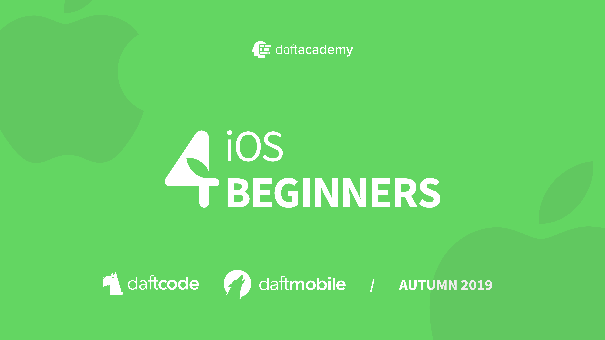

[](https://github.com/iOS-4-Beginners-Autumn-2019/home)


[](https://swift.org/)
[](https://ios4beginners-atm2019.slack.com/)

---

# iOS 4 Beginners class – MiNI, Autumn 2019

#### Worshop Results

Workshop results are available [_here_](https://docs.google.com/spreadsheets/d/1COKd67bX-iNHFPIIqV5BAYLvsQScN3x77fGMllJx39E/edit#gid=0).

Find your data row by hashing your email address using **sha256**. Use an online [tool](http://www.sha1-online.com), or run this bash command:

```sh
printf "email@domain.com" | openssl sha256
```

## Classes

### Class 1: Hello Swift

We were talking about the basics of Swift programming language:

- Variables and **constants** (`var` and `let` keywords)
- `String`
- `Array` and `Dictionary` data types (value types)
- Optionals (`Int?`, `String?`, `if let ...` syntax, and so on)
- Control Flow (`if`, `for` and `while` loops, `switch` statement (💪))
- Functions – defining a function with parameters in Swift (`func` keyword), return value type, calling functions, etc.
- Classes – defining a basic class, defining methods, class properties, initializers. We've also discussed inheritance in Swift, overriding methods and initializers.
- Enums!
- Structs
- Value Types vs Reference Types

To learn more, go through the [Swift](./Class1) playground.

### Assignment 1:

**See home assignment [here](https://classroom.github.com/a/q0jIlYaf).**

>Select *Accept this Assignment* after logging in to Github. This will create a repository with your username in it. This repository will contain the assignment and is a starter project – **clone** the repository, create your solution in it, and push it back to Github – that's it! 💪 Good luck! 🍀

>Remember to push your solutions before Saturday midnight 😉

## Resources

- [Install Swift on Linux](https://swift.org/download/#releases) - we're using version `5.1`
- [Open Source Swift](https://swift.org)
- [Free Swift Book](https://itunes.apple.com/us/book/the-swift-programming-language/id881256329?mt=11)
- [iOS Documentation](https://developer.apple.com/documentation/)
- [Apple Development Videos](https://developer.apple.com/videos/)

## Contact

- [Slack](https://ios4beginners-atm2019.slack.com/)
- [E-mail](mailto:ios@daftacademy.pl)
- [Twitter](https://twitter.com/mdab121)
