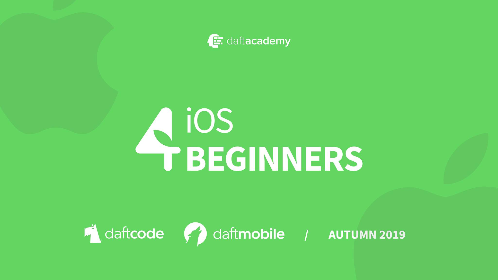

[](https://github.com/DaftMobile/ios4beginners_autumn2019)


[](https://swift.org/)
[](https://ios4beginners-atm2019.slack.com/)

---

### [Join our Slack!!!](https://join.slack.com/t/ios4beginners-atm2019/shared_invite/enQtODE1ODgyODgwNjI2LTE3MjNlYmZlNWU0ZDE3MzExNDJiMzkxMjUyY2E3MTY1ZjRlZjU2ODhiMWNkYTE3OGE5ZTExMDg4MDY5ZjYyNDY)

---

# iOS 4 Beginners class – MiNI, Autumn 2019

#### Worshop Results

Workshop results are available [_here_](https://docs.google.com/spreadsheets/d/1COKd67bX-iNHFPIIqV5BAYLvsQScN3x77fGMllJx39E/edit#gid=0).

Find your data row by hashing your email address using **sha256**. Use an online [tool](http://www.sha1-online.com), or run this bash command:

```sh
printf "email@domain.com" | openssl sha256
```

## Classes

## Resources

- [Install Swift on Linux](https://swift.org/download/#releases) - we're using version `5.1`
- [Open Source Swift](https://swift.org)
- [Free Swift Book](https://itunes.apple.com/us/book/the-swift-programming-language/id881256329?mt=11)
- [iOS Documentation](https://developer.apple.com/documentation/)
- [Apple Development Videos](https://developer.apple.com/videos/)

## Contact

- [Slack](https://ios4beginners-atm2019.slack.com/)
- [E-mail](mailto:ios@daftacademy.pl)
- [Twitter](https://twitter.com/mdab121)
