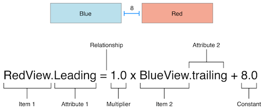

[](https://github.com/iOS-4-Beginners-Autumn-2019/home)


[](https://swift.org/)
[](https://ios4beginners-atm2019.slack.com/)

---

# iOS 4 Beginners class – MiNI, Autumn 2019

#### Worshop Results

Workshop results are available [_here_](https://docs.google.com/spreadsheets/d/1COKd67bX-iNHFPIIqV5BAYLvsQScN3x77fGMllJx39E/edit#gid=0).

Find your data row by hashing your email address using **sha256**. Use an online [tool](http://www.sha1-online.com), or run this bash command:

```sh
printf "email@domain.com" | openssl sha256
```

## Classes

### Class 1: Hello Swift

We were talking about the basics of Swift programming language:

- Variables and **constants** (`var` and `let` keywords)
- `String`
- `Array` and `Dictionary` data types (value types)
- Optionals (`Int?`, `String?`, `if let ...` syntax, and so on)
- Control Flow (`if`, `for` and `while` loops, `switch` statement (💪))
- Functions – defining a function with parameters in Swift (`func` keyword), return value type, calling functions, etc.
- Classes – defining a basic class, defining methods, class properties, initializers. We've also discussed inheritance in Swift, overriding methods and initializers.
- Enums!
- Structs
- Value Types vs Reference Types

To learn more, go through the [Swift](./Class1) playground.

### Assignment 1:

**See home assignment [here](https://classroom.github.com/a/q0jIlYaf).**

>Select *Accept this Assignment* after logging in to Github. This will create a repository with your username in it. This repository will contain the assignment and is a starter project – **clone** the repository, create your solution in it, and push it back to Github – that's it! 💪 Good luck! 🍀

>Remember to push your solutions before Saturday midnight 😉

---

### Class 2: iOS Design Patterns & Memory Management

We were talking about Model View Controller application architecture pattern. This approach is strongly recommended by Apple, including all UIKit API designs. You can read more about Apple's interpretation of MVC [here](https://developer.apple.com/library/content/documentation/General/Conceptual/DevPedia-CocoaCore/MVC.html). That's the design pattern that is the easiest to use and understand in small apps (like those we will build during this class).

In summary:

1. Separate your classes into three categories:
	- **Models**: The core of your app's logic. Your database, your business logic, your network requests, etc.
	- **Views**: The most generic and reusable objects here. A `UILabel` and a `UIButton` are views (most of views are subclass of `UIView`) - they don't know anything about what they're displaying or what actions they perform.
	- **Controllers**: Subclasses of `UIViewController`. Their responsibility is to display model data in the views, as well as handle user's actions and represent them to the model
2. Don't let **views** and **models** communicate! Ever! ✋🛑
3. Controllers should own their models.
4. Controllers should own their views.
5. Views communicate with their controllers by [**target-action**](https://developer.apple.com/library/content/documentation/General/Conceptual/Devpedia-CocoaApp/TargetAction.html) mechanism, or by [**delegation**](https://developer.apple.com/library/content/documentation/General/Conceptual/CocoaEncyclopedia/DelegatesandDataSources/DelegatesandDataSources.html) (via `weak` variables and protocols).
6. Models communicate with controllers by notifications (see [`NotificationCenter`](https://developer.apple.com/documentation/foundation/notificationcenter)) (to inform about updates) or by completion [**closures**](https://developer.apple.com/library/content/documentation/Swift/Conceptual/Swift_Programming_Language/Closures.html).

###### Examples:

During this class we've built two sample apps. They both utilize the MVC approach, which works perfectly here. Check out our [Button Counter](./Class%203/ButtonCounter) app.

>You can read all about *MVC*, *MVVM* and other iOS Design Patterns in [this great article](https://medium.com/ios-os-x-development/ios-architecture-patterns-ecba4c38de52) by Bohdan Orlov.

### Assignment 2:

See home assignment **Smile App** [here](https://classroom.github.com/g/rMx1ZR6N).

>The assignment is to be completed in two person teams. I know it's an easy one, but the following assignments are going to be more difficult, and you need to learn *git collaboration*.

>Remember to push your solutions before Saturday midnight 😉

### Class 3: UIKit Basics + AutoLayout

Finally some UIKit and `UIView`s! We've discussed the basic `UIKit` concepts:

1. View hierarchy
2. `UIView` and its subclasses
3. Concept of adding a `subview`, and a `superview`
4. Coordinate system on iOS
5. View coordinate properties:
	- [`frame`](https://developer.apple.com/documentation/uikit/uiview/1622621-frame)
	- [`bounds`](https://developer.apple.com/documentation/uikit/uiview/1622580-bounds)
	- [`center`](https://developer.apple.com/documentation/uikit/uiview/1622627-center)

The we talked about Auto Layout. Auto Layout is a view positioning system designed to work on multiple devices and screen sizes. Auto Layout dynamically calculates the size and position of all the views in your view hierarchy, based on constraints placed on those views.

In Auto Layout we use [constraints](https://developer.apple.com/library/archive/documentation/UserExperience/Conceptual/AutolayoutPG/AnatomyofaConstraint.html#//apple_ref/doc/uid/TP40010853-CH9-SW1) to position views.



### Assignment 3:

See home assignment **Pokemon Toggle** [here](https://classroom.github.com/g/EMdbJ8iZ).

>The assignment is to be completed in two person teams. I know it's an easy one, but the following assignments are going to be more difficult, and you need to learn *git collaboration*.

>Remember to push your solutions before Saturday midnight 😉

### Class 4: Networking 101

We've disussed two new Swift and Foundation concepts: [Error handling](https://developer.apple.com/library/content/documentation/Swift/Conceptual/Swift_Programming_Language/ErrorHandling.html) and threading using [DispatchQueue](https://developer.apple.com/documentation/dispatch/dispatchqueue).

Next we dove into iOS Networking APIs. Starting with a basic initializer of `Data`: `init(contentsOf url: URL) throws`, which is a _blocking_ API call (which means you musn't use it on the main thread!!). This call handles the URL request behind the scenes, but does it on the queue in which you make the call.

Next, we covered the most important iOS Networking class: `URLSession`. We talked about `URLSession` initialization process (using `URLSessionConfiguration`), as well as how to create data tasks with completion closure using a `URLSession`. Remember that `URLSession` handles threading on its own, so there's no need to use `DispatchQueue.global()` to make a URLSession task. However, remember that the completion closure is called **on the networking queue**, so you probably need a `DispatchQueue.main.async { }` there.

### Assignment 4:

See home assignment **Pokédex** [here](https://classroom.github.com/g/xOfMolsl).

## Resources

- [Install Swift on Linux](https://swift.org/download/#releases) - we're using version `5.1`
- [Open Source Swift](https://swift.org)
- [Free Swift Book](https://itunes.apple.com/us/book/the-swift-programming-language/id881256329?mt=11)
- [iOS Documentation](https://developer.apple.com/documentation/)
- [Apple Development Videos](https://developer.apple.com/videos/)
- [Git collaboration](https://www.atlassian.com/git/tutorials/comparing-workflows)

## Contact

- [Slack](https://ios4beginners-atm2019.slack.com/)
- [E-mail](mailto:ios@daftacademy.pl)
- [Twitter](https://twitter.com/mdab121)
